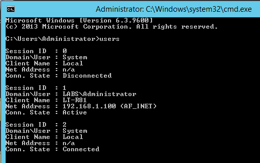

Users
=====

This program is similar to "net user," "quser" and the users tab in Task Manager, in that it displays a list of users who are currently logged on to either the local or a remote computer. But this program is better in the following ways:

1. I wrote it.
2. It shows the connected client's originating hostname and IP, which none of the built-in utilities do.

